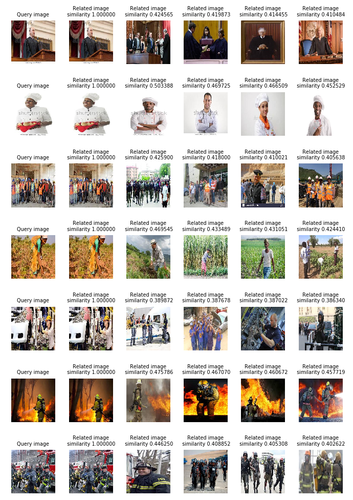

# Hy Image Search
An image search implementation in python using tensorflow keras, scikit-learn, scipy and matplotlib.

The image embeddings are generated from Xception imagenet (*can be changed/tuned from [features.py](features.py)*).
Currently the embeddings are stored using pickle, but a database may be used instead.
Image embeddings are compared cosine similarity and hamming.

## Running search on image(s) from console args
1. Run *[search.py](search.py)* with image path(s) as arguments and the script will display the top matches from underlying image library

**Sample**

## Running search on a  custom set of images
1. Transfer the images to queries folder *[data/queries/](data/queries)* or alternatively change `query_images_folder_path` from *[paths.py](paths.py)* to your location of your image set.
2. Run *[search.py](search.py)* and the script will display the top matches from underlying image library

**Sample**

## Generating embeddings for a new image set
1. Transfer the images to images folder *[data/images/](data/images)* or alternatively change `images_folder_path` from *[paths.py](paths.py)* to your location of your image set.
2. Run *[features.py](features.py)* and you should have the embeddings generated

## Viewing the similarity map in underlying image library (PCA and t-SNE)
1. Run *[dataset.py](dataset.py)* and you should get a visualization similar to this

----------

*The sample images used here are from idenprof dataset*